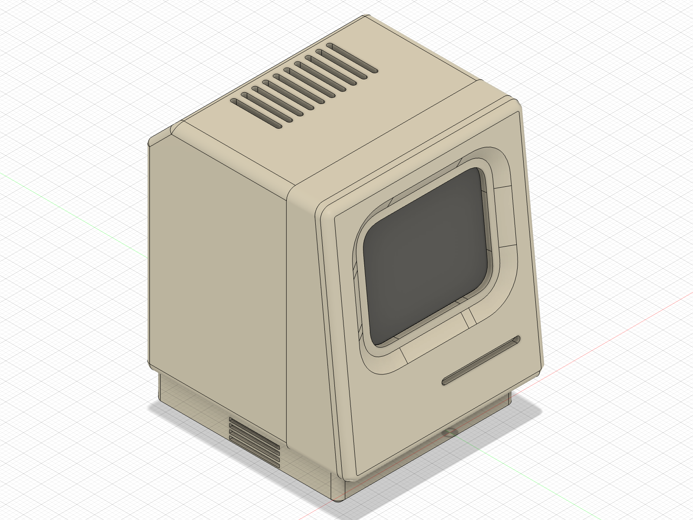
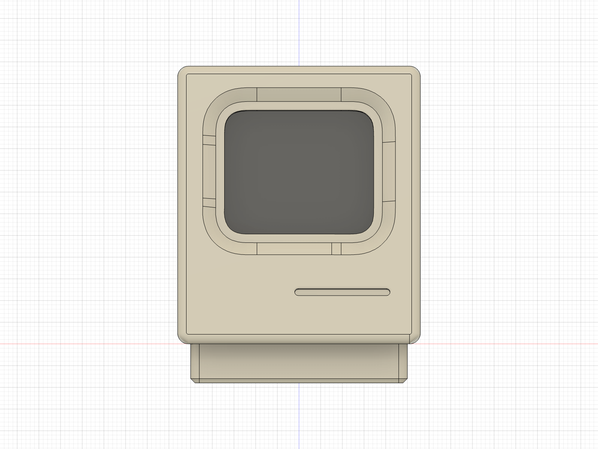
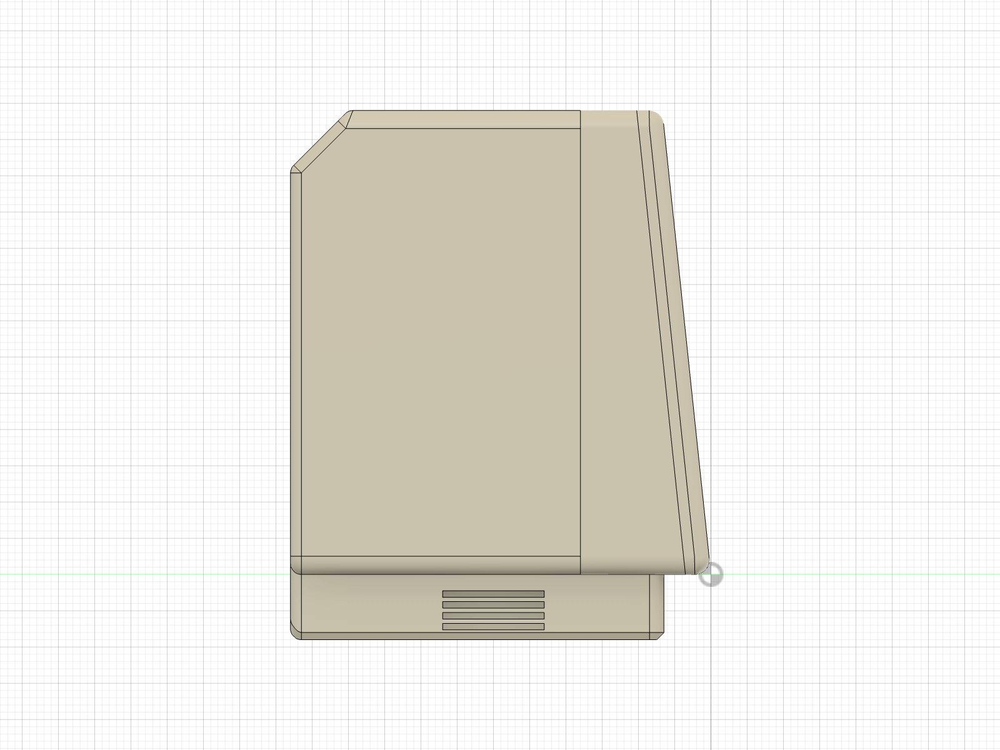
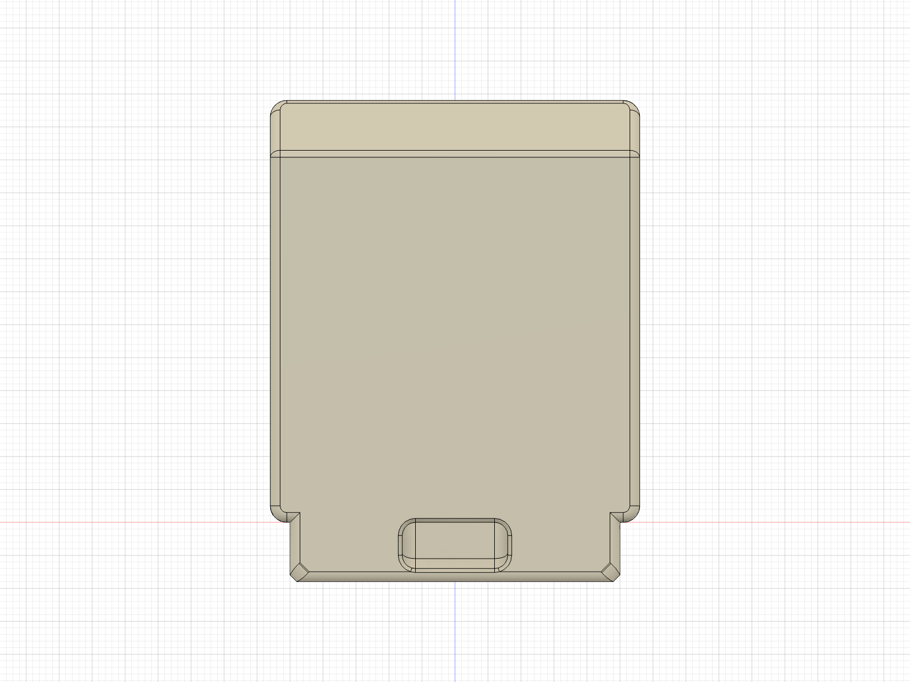
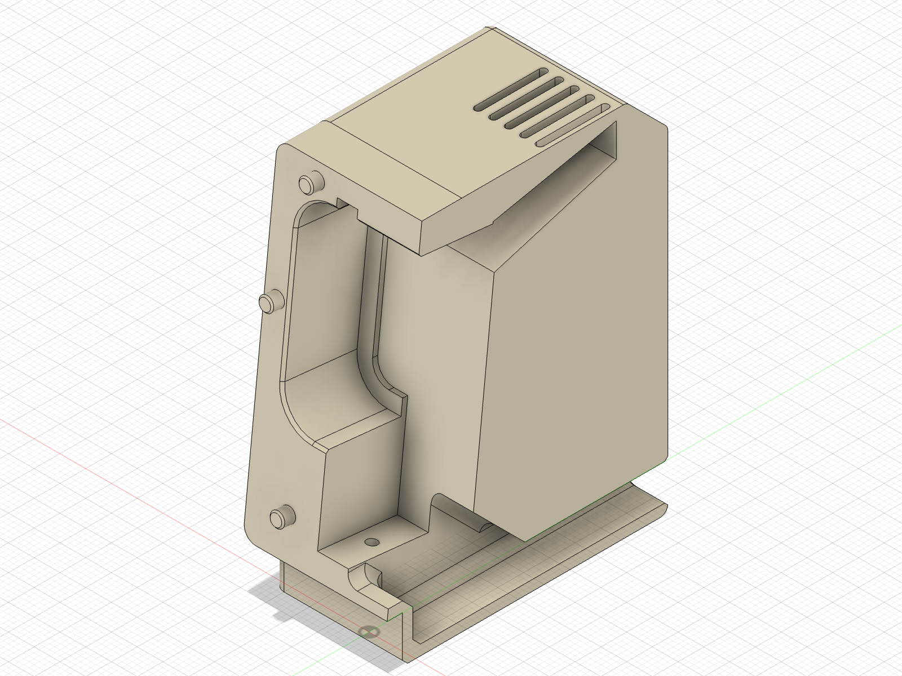

# ESP32 Mac

A mini retro-Macintosh enclosure for the Waveshare
[ESP32-S3-Touch-AMOLED-1.8](https://www.waveshare.com/esp32-s3-touch-amoled-1.8.htm), designed in Fusion 360 and
printed in two parts with no supports and no hardware.

The board stays in its own case and drops into a pocket from the front. A separate face plate presses onto six
integrated pins (a dab of glue makes it permanent). The USB-C cable runs down a chute inside the body and out through
the foot, so nothing shows at the back. Warm air rises from behind the board through a duct to the vent slots on top,
and two grooves link the case's speaker and mic holes to the same duct.

| | |
|---|---|
|  |  |
|  |  |

## Files

- `stl/` - print-ready `MiniMac_Body`, `MiniMac_FacePlate` and `MiniMac_FitGauge`
- `step/` - the same three parts as STEP
- `MiniMac.f3d` - the Fusion 360 design (it includes Waveshare's board model, imported from their wiki)
- `scripts/` - the Fusion API scripts that generate everything from one parameter block ([details](scripts/README.md))
- `renders/` - views, sections and a four-view sheet per part

## Printing

| Part | Orientation | Notes |
|---|---|---|
| Body | rear face down | 10-15 % infill, 5-6 top layers, no supports |
| FacePlate | face up | no supports; iron the top layer if you can |
| FitGauge | flat | 6 mm slab with the pocket and pins; print it first to check the fit |

0.12-0.16 mm layers, 3-4 walls. The body is 56 x 64 x 58 mm on a 9 mm foot, 73 mm tall overall.

The pocket is 45.4 x 37.7 mm for a case that measures 44.9 x 37.3, sized for a printer that comes out about 0.25 mm
tight per side. If the board is loose or won't go in, change `POCKET_W` and `POCKET_H` in `scripts/build.py` and
reprint the gauge.

## Assembly

1. Feed the far end of the cable from the plug cavity down the chute, through the foot and out of the back.
2. Drop the board into the pocket, glass first.
3. Reach into the cavity and push the right-angle USB-C plug up into the socket.
4. Press the face plate onto the pins.

The board mounts landscape with its USB-C edge down, so rotate the UI 90 degrees in firmware.

## Rebuilding the model

`scripts/build.py` regenerates all three parts from the parameters at its top: pocket size, wall thicknesses, vents,
cable route. It needs Fusion 360 with Waveshare's 3D model imported. Download `ESP32-S3-Touch-AMOLED-1.8-3D.zip`
from the [Waveshare wiki](https://www.waveshare.com/wiki/ESP32-S3-Touch-AMOLED-1.8), unzip the `.stp` into
`reference/`, then run `import_step.py`, `build.py`, `checks.py` and `export.py` in that order from Fusion's Scripts
panel.
